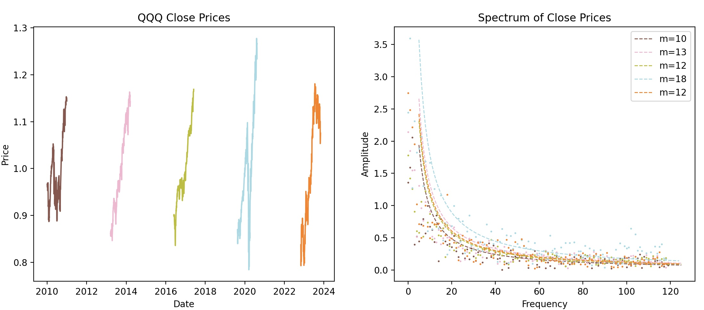
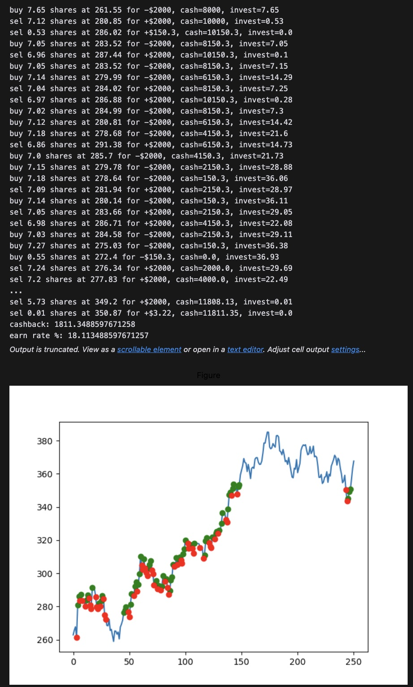

# finding grid trading parameters by monte carlo noise simulation

Looking at [articles online](https://easylanguagemastery.com/indicators/predictive-indicators/), stocks generally follow a fractal pattern where the variation scales proportionally with time period, so the price variation within 100 days is roughly 10x larger than the variation within 10 days. In Python, I took the fast Fourier transform of QQQ prices to get the relationship between amplitude and frequency, which seems to match 1/x alright.

This can be modeled by pink noise (https://en.wikipedia.org/wiki/Pink_noise), where amplitude of variation ≈ 1/frequency. I think there are equations to calculate the probability that the noise reaches a certain level (price) within an amount of time. In Python, I can simulate random pink noise using the parameters from real price data from the past.

Each simulation is different, and running thousands of simulations, I’m thinking the program can try different values to automatically sell and buy at. In the picture, the green is sell, red is buy.

